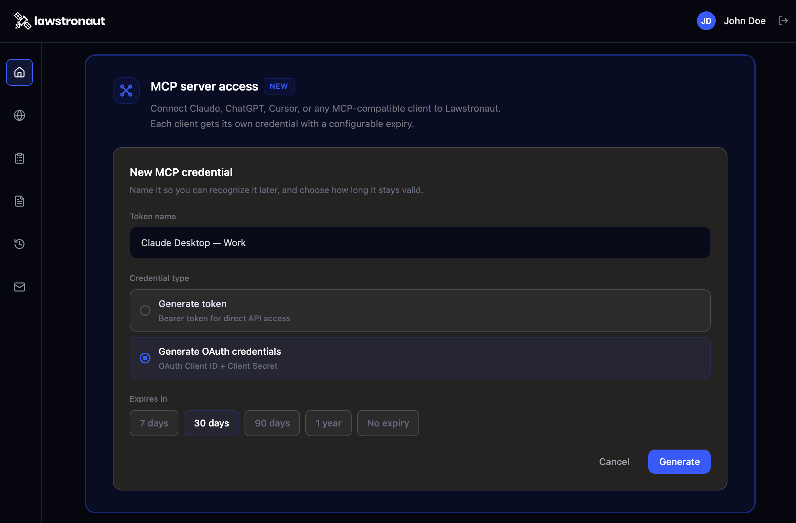
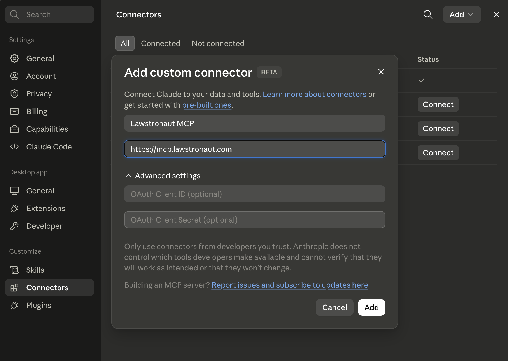

<div align="center">


# Lawstronaut MCP

Connect [lawstronaut](https://mcp.lawstronaut.com) to Claude, ChatGPT, Cursor, and any AI agent that speaks the [Model Context Protocol](https://modelcontextprotocol.io). Connect your AI to 50+ million laws and court cases!

[](https://modelcontextprotocol.io)
[](#authentication--scopes)
[](https://lawstronaut.com/products/lawstronaut-mcp)
[](./LICENSE)

 [Authentication](#Authentication) . [Setup](#setup) · [Tools](#tools)

</div>

---

## What is this?

Lawstronaut is the infrastructure layer that connects AI agents and software to millions of legal documents across 150+ jurisdictions, structured legal data, continuously updated, and ready to use via MCP.

## Authentication

Production MCP server: **`https://mcp.lawstronaut.com`**

Transport: **MCP over Streamable HTTP** (`POST /`).

Public server card (tool listing, no auth):  
`https://mcp.lawstronaut.com/.well-known/mcp/server-card.json`

---


Lawstronaut MCP supports **Bearer token** and **OAuth 2.0** (`client_id` + `client_secret`). A paid subscription is required.

| Method | Best for | Tool listing | Tool calls |
|--------|----------|--------------|------------|
| Bearer token | CLI, scripts, clients without OAuth | No auth required | `Authorization: Bearer <token>` |
| OAuth 2.0 | Cursor, VS Code, Claude, publishing platforms | No auth required | OAuth access token (auto-managed by client) |

### Get client ID, secret, or bearer token

1. Visit [lawstronaut.com](https://lawstronaut.com) and purchase a subscription.
2. Log in to the [developer portal](https://dev-portal.filerskeepersapi.co/).
3. Open **MCP server access** from the Home menu.
4. Create a **client ID** + **client secret** (OAuth) or a **bearer token**.



### Option A — Bearer token

Use the bearer token from **MCP server access**:

```http
Authorization: Bearer <your-token>
```

Set it in your environment:

```bash
export LAWSTRONAUT_MCP_BEARER_TOKEN="your-token-here"
```

Example configs: `cursor-mcp.json`, `vscode-mcp.json`, `claude-code.mcp.json`.

### Option B — OAuth 2.0 (client_id + client_secret)

Use the `client_id` and `client_secret` created under **MCP server access** in the [developer portal](https://dev-portal.filerskeepersapi.co/).

| Endpoint | URL |
|----------|-----|
| MCP server | `https://mcp.lawstronaut.com` |
| Authorization | `https://mcp.lawstronaut.com/oauth/authorize` |
| Token | `https://mcp.lawstronaut.com/oauth/token` |
| OAuth discovery | `https://mcp.lawstronaut.com/.well-known/oauth-authorization-server` |
| Protected resource | `https://mcp.lawstronaut.com/.well-known/oauth-protected-resource` |

**Flow:** `response_type=code` → redirect with `code` → exchange at `/oauth/token` with `grant_type=authorization_code`, `client_id`, `client_secret`, `code`, and `redirect_uri`.

Clients that support MCP OAuth discovery only need the server URL — they handle the flow using your registered `client_id` / `client_secret`.

Example configs: `cursor-mcp-oauth.json`, `vscode-mcp-oauth.json`.

---
## Setup
Pick your client, paste the config, and authenticate with your lawstronaut account. Most clients open a browser window for OAuth the first time an agent uses a lawstronaut tools.

## Cursor

**Bearer token**

1. Copy `cursor-mcp.json` to `.cursor/mcp.json` (project) or `~/.cursor/mcp.json` (global).
2. Export `LAWSTRONAUT_MCP_BEARER_TOKEN`.
3. Restart Cursor. Check **Output → MCP Logs** if connection fails.

**OAuth**

1. Copy `cursor-mcp-oauth.json` to `.cursor/mcp.json`.
2. Complete the OAuth sign-in when Cursor prompts you (uses your registered `client_id` / `client_secret`).

Docs: [Cursor MCP](https://cursor.com/docs/context/mcp).

---

## VS Code (GitHub Copilot agent / MCP)

**Bearer token**

1. Copy `vscode-mcp.json` to `.vscode/mcp.json`, or merge into your [user MCP config](https://code.visualstudio.com/docs/copilot/reference/mcp-configuration).
2. Run **MCP: List Servers** and enter your bearer token when prompted.

**OAuth**

1. Copy `vscode-mcp-oauth.json` to `.vscode/mcp.json`.
2. Sign in through VS Code when prompted.

Docs: [MCP configuration reference](https://code.visualstudio.com/docs/copilot/reference/mcp-configuration).

---

## Claude Code (CLI)

**Bearer token — CLI**

```bash
export LAWSTRONAUT_MCP_BEARER_TOKEN="your-token-here"

claude mcp add --transport http lawstronaut-mcp https://mcp.lawstronaut.com \
  --header "Authorization: Bearer $LAWSTRONAUT_MCP_BEARER_TOKEN"
```

**Bearer token — project file**

Copy `claude-code.mcp.json` to `.mcp.json` in your project root.

**OAuth**

Add the server URL only and complete OAuth when prompted:

```bash
claude mcp add --transport http lawstronaut-mcp https://mcp.lawstronaut.com
```

Docs: [Connect Claude Code to tools via MCP](https://code.claude.com/docs/en/mcp).

---

## Claude Desktop (Anthropic app)

Claude Desktop is oriented toward **stdio** MCP servers. For this HTTP server, use **Cursor**, **VS Code**, or **Claude Code**, or any host that supports remote Streamable HTTP MCP.

Go to **Customize**, **Connectors**, click "**+**", **Add Custom Connector**, and fill the dialog:



---

## Other hosts (Continue, Zed, custom agents, etc.)

Any client that supports **MCP Streamable HTTP** can connect with:

- **URL:** `https://mcp.lawstronaut.com`
- **Bearer:** `Authorization: Bearer <token>`
- **OAuth:** use discovery at `/.well-known/oauth-authorization-server` with your `client_id` / `client_secret`

---

## Tools

| Tool | Description | Scope |
|------|-------------|-------|
| `list_jurisdictions` | List all jurisdictions (countries/states) in the Lawstronaut corpus — call first to get valid ISO codes for other tools. | `mcp:tools:read` |
| `list_domains` | List legal domains with optional name filter and pagination. | `mcp:tools:read` |
| `list_subdomains` | List subdomains for a domain ID — filter by name, paginate results. | `mcp:tools:read` |
| `list_categories` | List legal categories for a subdomain — filter by name, paginate results. | `mcp:tools:read` |
| `list_subcategories` | List subcategories for a category ID — filter by name, paginate results. | `mcp:tools:read` |
| `list_law_types` | List law types for a subcategory ID — filter by name, paginate results. | `mcp:tools:read` |
| `list_portals` | List legal portals for a jurisdiction — filter by name, language, or tag. | `mcp:tools:read` |
| `list_authority_types` | List authority types for a jurisdiction — filter by portal or authority type. | `mcp:tools:read` |
| `list_issuing_authorities` | List issuing authorities for a jurisdiction — filter by portal or authority name. | `mcp:tools:read` |
| `list_documents` | List legal documents in a jurisdiction — filter by title, dates, portal, status, tags, and more. | `mcp:tools:read` |
| `get_document_text` | Get full text of documents matching jurisdiction and filter criteria. | `mcp:tools:read` |
| `get_markdown` | Get document body as markdown for matching jurisdiction and filters. | `mcp:tools:read` |
| `get_source_url` | Get a time-limited signed URL to the original source file (PDF, etc.). | `mcp:tools:read` |
| `get_document_with_version` | Get a specific document at a specific version with full metadata. | `mcp:tools:read` |
| `horizon_scan` | Scan recent legal changes in a jurisdiction — filter by topic, date window, and authority. | `mcp:tools:read` |
| `evidence_pull` | Get full citation chain for a document — metadata, legal link, source URL, and body text. | `mcp:tools:read` |

All tools are read-only. OAuth tokens are issued with scope `mcp:tools:read`. Tool listing is public; tool calls require authentication.

---
